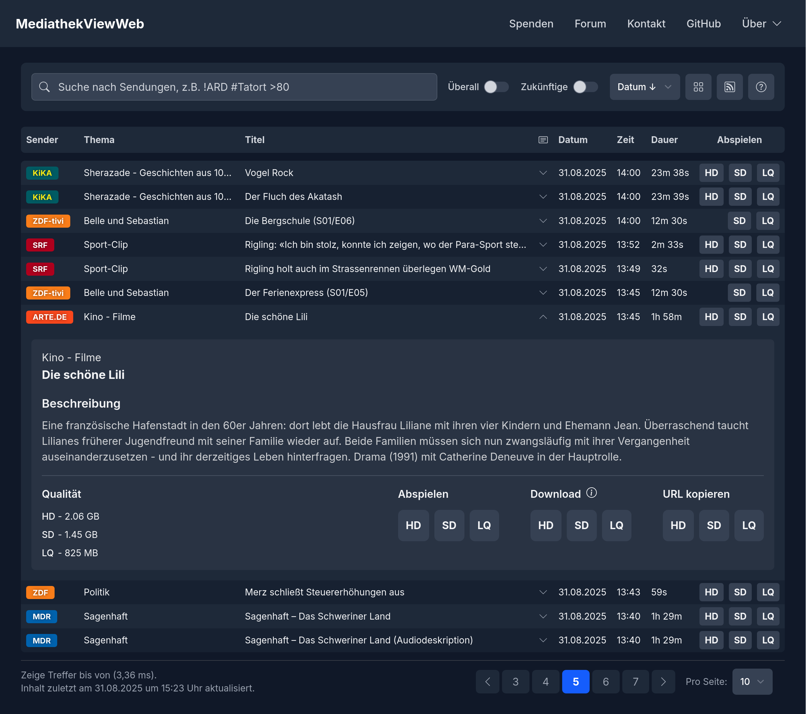

# MediathekViewWeb → [mediathekviewweb.de](https://mediathekviewweb.de/)

MediathekViewWeb ist eine Web-Oberfläche für den schnellen und einfachen Zugriff auf die Filmliste des [MediathekView Projekts](https://mediathekview.de/).

Im Gegensatz zur Desktop-Anwendung MediathekView muss bei MediathekViewWeb weder ein Programm installiert noch eine Filmliste manuell geladen werden. Die Suche steht augenblicklich im Browser zur Verfügung – auch auf Smartphones und Tablets.



## Features im Überblick

- **Keine Installation:** Einfach im Browser öffnen und lossuchen.
- **Blitzschnelle Suche:** Suchanfragen werden direkt auf dem Server verarbeitet.
- **Leistungsstarke Suchsyntax:** Filtere präzise nach Sender, Thema, Titel, Dauer und mehr.
- **Mobilfreundlich:** Das responsive Design funktioniert auf Desktops, Tablets und Smartphones.
- **Integrierter Videoplayer:** Viele Inhalte können direkt auf der Website abgespielt werden.
- **RSS-Feeds:** Abonniere deine Suchen und bleibe über neue Inhalte auf dem Laufenden.

## Bedienung & Suchsyntax

### Grundlagen

Tippe einfach einen Suchbegriff in die Suchleiste ein. Standardmäßig wird in den Feldern **Thema** und **Titel** gesucht. In den Ergebnissen kannst du Videos direkt abspielen oder herunterladen.

### Erweiterte Suche mit Selektoren

Für präzisere Ergebnisse kannst du spezielle Selektoren verwenden. Ein Selektor besteht aus einem Symbol, gefolgt von deinem Suchbegriff (ohne Leerzeichen).

| Selektor | Feld             | Beispiel      | Beschreibung                                               |
| :------- | :--------------- | :------------ | :--------------------------------------------------------- |
| `!`      | Sender           | `!ARD`        | Findet Inhalte des Senders "ARD".                          |
| `#`      | Thema            | `#Tatort`     | Findet Inhalte mit dem Thema "Tatort".                     |
| `+`      | Titel            | `+Schokolade` | Findet Inhalte mit "Schokolade" im Titel.                  |
| `*`      | Beschreibung     | `*Berlin`     | Findet Inhalte mit "Berlin" in der Beschreibung.           |
| `>`      | Dauer            | `>80`         | Findet Inhalte, die länger als 80 Minuten sind.            |
| `<`      | Dauer            | `<10`         | Findet Inhalte, die kürzer als 10 Minuten sind.            |
| (keiner) | Allgemeine Suche | `Nachrichten` | Sucht standardmäßig nach "Nachrichten" in Thema und Titel. |

#### Selektoren kombinieren

Du kannst mehrere Selektoren kombinieren, um deine Suche weiter zu verfeinern.

**Beispiel:** `!ARD #Tatort`

Findet alle "Tatort"-Folgen des Senders ARD.

#### Mehrere Werte pro Selektor (ODER-Suche)

Wenn du denselben Selektor mehrmals verwendest, werden die Werte mit **ODER** verknüpft.

**Beispiel:** `!ARD !ZDF #Reportage`

Findet alle Reportagen, die entweder auf ARD **oder** ZDF liefen.

#### Mehrere Wörter pro Wert (UND-Suche)

Um nach Inhalten zu suchen, die mehrere Wörter enthalten müssen, trenne diese mit einem Komma (`,`). Dies funktioniert für die Selektoren `!`, `#`, `+` und `*`.

**Beispiel:** `#Olympia,Tokio`

Findet Inhalte, die im Thema "Olympia" **und** "Tokio" enthalten.

### Weitere Beispiele

1.  **Finde alle Tatort-Folgen von ARD oder WDR, die länger als 80 Minuten sind:**

    ```
    !ARD !WDR #Tatort >80
    ```

2.  **Finde Dokumentationen über das Weltall und das Universum auf ZDFinfo**

    ```
    !ZDFinfo #weltall #universum >30
    ```

3.  **Finde einzelne Beiträge von Tagesschau24, die kürzer als 10 Minuten sind:**

    ```
    #tagesschau24 <10
    ```

4.  **Finde Inhalte zu "Sturm der Liebe" _und_ "Rote Rosen" von ARD _und_ NDR:**

    ```
    !ard !ndr #sturm,der,liebe #rote,rosen
    ```

### Weitere Funktionen

#### Der "Überall"-Schalter

Wenn dieser Schalter aktiviert ist, sucht ein allgemeiner Begriff (ohne Selektor) in **allen** Feldern: Sender, Thema, Titel und Beschreibung. Das ist nützlich für eine breitere Suche.

#### Sortierung

Die Suchergebnisse können nach verschiedenen Kriterien wie Datum, Dauer oder Sender auf- und absteigend sortiert werden.

#### RSS-Feed

Jede Suchanfrage kann als [RSS-Feed](<https://de.wikipedia.org/wiki/RSS_(Web-Feed)>) abonniert werden. Klicke dazu auf das RSS-Symbol, um den Feed-Link zu erhalten. So wirst du automatisch über neue Ergebnisse informiert.

## FAQ

### Warum kann ich SRF- und ORF-Beiträge nicht direkt herunterladen?

Die Sender ORF und SRF stellen ihre Inhalte oft nur als HLS-Streams zur Verfügung, nicht als einzelne Videodatei. Diese Streams können zwar direkt auf der Webseite abgespielt werden, der Download liefert aber nur eine `.m3u8`-Playlist-Datei.

Um diese Streams dennoch herunterzuladen, empfehlen wir Desktop-Client [MediathekView](https://mediathekview.de/) oder spezialisierte Tools wie [yt-dlp](https://yt-dlp.org/) oder den VLC Media Player.

### Wie kann ich Streams mit VLC speichern?

#### Voraussetzung

- [VLC Media Player](https://www.videolan.org/vlc/) ist installiert.
- Der Link zum `.m3u8`-Stream befindet sich in der Zwischenablage (aus MediathekViewWeb kopiert).

#### Konvertierung

1.  Öffne VLC.
2.  Öffne den Dialog "Medien" über das Menü: `Medien` > `Netzwerkstream öffnen...`
3.  Füge den `.m3u8`-Link aus der Zwischenablage in das Adressfeld ein.
4.  Klicke neben "Wiedergeben" auf den Pfeil und wähle "Konvertieren".
5.  Wähle im neuen Fenster ein **Profil** aus (z.B. `Video - H.264 + MP3 (MP4)`).
6.  (Optional - Empfohlen) Originalqualität beibehalten und Zeit sparen
    1.  Öffne die Bearbeitung für das Profil (Schraubenschlüssel).
    2.  Klicke auf den Reiter Videocodec und aktiviere `Originalvideospur beibehalten`.
    3.  Klicke auf den Reiter "Audiocodec" und aktiviere dort `Originalaudiospur beibehalten`.
    4.  Klick auf speichern.
7.  Gib über **"Durchsuchen"** eine **Zieldatei** an.
8.  Klicke auf **"Start"**.

## Für Entwickler

### Technologie-Stack

#### Serverseitig

- **Node.js**: Serverseitige JavaScript-Laufzeitumgebung.
- **Express**: Web-Framework für die API.
- **OpenSearch**: Such- und Analyse-Engine für die Indizierung und Abfrage der Filmliste.
- **Valkey**: Ein leistungsstarker In-Memory-Datenspeicher (Fork von Redis) für Caching.

#### Clientseitig

- **Svelte**: Reaktives Frontend-Framework zum Erstellen der Benutzeroberfläche.
- **Tailwind CSS**: Ein CSS-Framework für modernes und responsives Design.
- **Video.js**: Ein erweiterbarer HTML5-Videoplayer.
